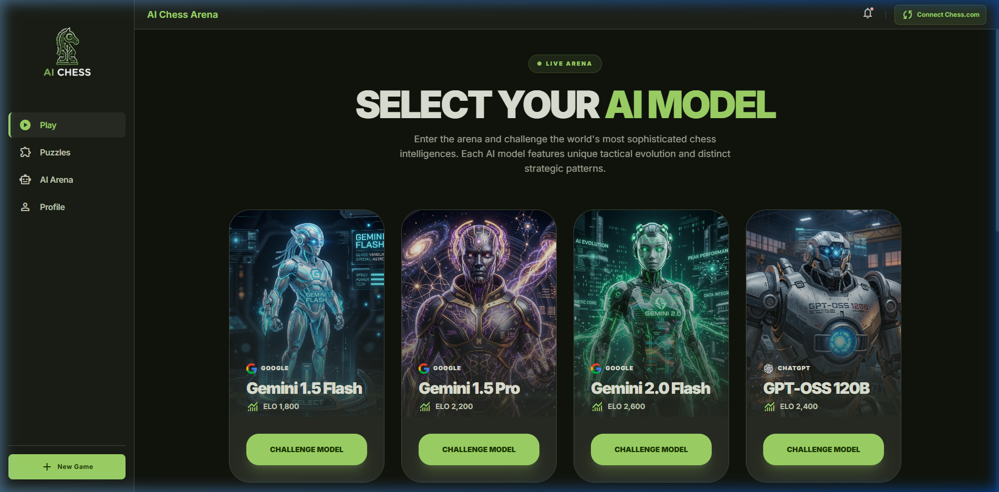
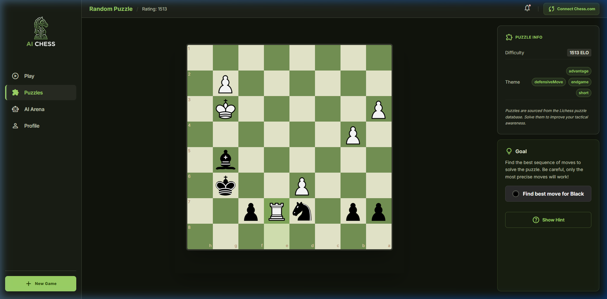

# AI Chess Arena

AI Chess Arena is a premier, full-stack chess platform designed for players who want to test their skills against state-of-the-art AI models. From high-ELO grandmaster-level engines to tactical puzzle training, the platform offers a comprehensive suite of tools for the modern chess enthusiast.

**Live Demo**: [https://aichess-623337263486.europe-west1.run.app](https://aichess-623337263486.europe-west1.run.app)




### Tactical Training



## ✨ Features

- **Advanced AI Opponents**: Challenge a variety of AI models including Google's Gemini 1.5 Pro/Flash, Gemini 2.0, and GPT-OSS 120B, each with unique strategic profiles and tactical evolution.
- **12,000+ Self-Hosted Puzzles**: Access a massive library of over 12,000 tactical puzzles, all self-hosted locally in an optimized SQLite database using Prisma for lightning-fast retrieval and offline capability.
- **Chess.com Integration**: Connect your Chess.com account to sync your profile, import your global ratings, and maintain a consistent chess identity across platforms.
- **Dynamic Board Interface**: A sleek, responsive chessboard with smooth animations, intuitive controls, and premium aesthetics.
- **Performance Tracking**: Built-in player profiles to monitor ELO ratings, win rates, and tactical progress.


## 🛠️ Technology Stack

- **Frontend**: [Next.js 14+](https://nextjs.org/) (App Router), [React](https://reactjs.org/), [Tailwind CSS](https://tailwindcss.com/)
- **Backend**: Next.js API Routes, Node.js
- **Database**: [SQLite](https://www.sqlite.org/) (via [Prisma ORM](https://www.prisma.io/))
- **AI Integration**: Custom handlers for Gemini, Groq (Llama), and Ollama models.
- **Animations**: [Framer Motion](https://www.framer.com/motion/)

## 🚀 Getting Started

### Prerequisites

- Node.js 18+ 
- npm or yarn

### Installation

1. **Clone the repository**:
   ```bash
   git clone https://github.com/bakht/aichess.git
   cd aichess/chess-app
   ```

2. **Install dependencies**:
   ```bash
   npm install
   ```

3. **Environment Setup**:
   Create a `.env.local` file in the `chess-app` directory:
   ```env
   DATABASE_URL="file:./prisma/puzzle.db"
   GEMINI_API_KEY="your_api_key_here"
   GROQ_API_KEY="your_api_key_here"
   ```

4. **Database Setup**:
   ```bash
   npx prisma generate
   npx prisma db push
   ```

5. **Start Development Server**:
   ```bash
   npm run dev
   ```

Open [http://localhost:3000](http://localhost:3000) to view the application.

## 🐳 Docker Deployment

The project is fully containerized for easy deployment:
```bash
docker build -t aichess .
docker run -p 3000:3000 aichess
```

---

